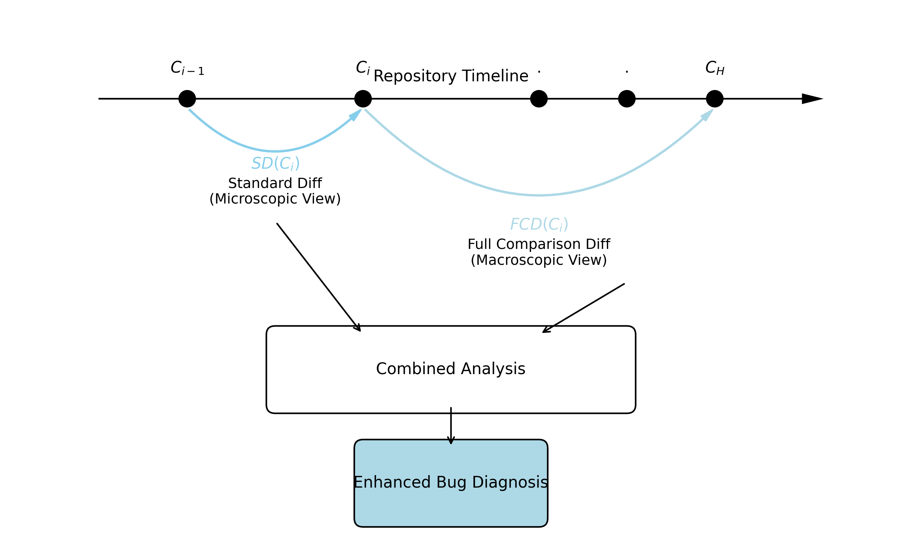

<div align="center">

# Enhanced Bug Diagnosis via Dual-Context Diff Analysis: A Theoretical Framework for Combining Standard and Full Comparison Diffs

April 6, 2025

</div>

## Abstract
This paper presents a comprehensive theoretical framework demonstrating the substantial advantages of combining standard diffs (commit vs. parent) with full comparison diffs (commit vs. HEAD) for complex bug diagnosis in software development. We formalize definitions for different types of code changes, model bug scenarios spanning temporal and contextual dimensions, analyze the information value of each diff type, and establish the synergistic diagnostic power of their combination. Drawing from software engineering principles, cognitive science, and information theory, we argue that this dual-context approach provides a more complete diagnostic picture than either diff approach alone, significantly enhancing the identification and understanding of bugs that emerge through code evolution and interaction over time.

## 1 Introduction
Software debugging is an inherently complex task, particularly when bugs emerge from the interactions of multiple code changes across time. Traditional approaches to bug diagnosis often focus on individual commits in isolation, examining only the changes introduced relative to their immediate predecessors. This approach, while intuitive, fails to capture the full evolutionary context in which bugs may manifest.

This paper introduces a theoretical framework called Dual-Context Diff Analysis to address this limitation. By combining standard diffs (commit vs. parent) with full comparison diffs (commit vs. HEAD), we provide a more comprehensive view of how code changes both in their immediate context and within the broader evolution of the codebase. We demonstrate that this combined approach offers substantial advantages for diagnosing complex bugs, particularly those that emerge from interactions between code changes over time.

## 2 Formal Definitions and Notation
We begin by establishing precise definitions and notation to formalize our discussion:

**Definition 1 (Commit and Code State).**
*   **Commit ($C_i$):** A snapshot of the repository state at a specific point in time $t_i$.
*   **Code State ($S(C)$):** The complete state of the relevant codebase within commit $C$.
*   **Parent Commit ($C_{i-1}$):** The immediate predecessor commit to $C_i$.
*   **HEAD Commit ($C_H$):** The latest commit in the branch under analysis (current time $t_H$).

**Definition 2 (Diff Types).**
*   **Standard Diff ($SD(C_i)$):** The set of changes introduced specifically by commit $C_i$ relative to its parent $C_{i-1}$.
    $$SD(C_i) \approx S(C_i) - S(C_{i-1})$$
*   **Full Comparison Diff ($FCD(C_i)$):** The set of differences between the code state at the time of commit $C_i$ and the code state at HEAD ($C_H$).
    $$FCD(C_i) \approx S(C_H) - S(C_i)$$

**Definition 3 (Bug and Culpability).**
*   **Bug ($B$):** An observable erroneous behavior in the system state corresponding to $S(C_H)$.
*   **Bug Culprit ($C_k$):** A commit considered a candidate for introducing or significantly contributing to Bug $B$.

## 3 Local vs. Global Context: A Cognitive Framework
Before delving into specific bug scenarios, we establish a cognitive framework for understanding why combining both local and global contexts enhances bug diagnosis.

**Principle 1 (Information Perspective).**
*   **Local (Standard) Diff:** Provides a "microscopic view" of changes, showing precise modifications at a specific point in time.
*   **Global (Full) Diff:** Offers a "macroscopic view" of how code has evolved since the commit, revealing the broader context and downstream effects.

This dual perspective aligns with established cognitive science principles, where additional context often helps disambiguate signals and reduce uncertainty. When diagnosing bugs, knowledge of subsequent modifications (full-diff) can clarify which part of a local change remains relevant (or was undone) in later commits.

### 3.1 Information Value Analysis
We can formally characterize the information provided by each diff type:
*   $Info(SD(C_k))$: Provides information primarily about the action taken at $t_k$. It isolates the developer’s immediate change.
*   $Info(FCD(C_k))$: Provides information about the accumulated consequence of changes between $t_k$ and $t_H$ relative to the state $S(C_k)$.
*   $Info(SD(C_k), FCD(C_k))$: Provides an integrated view, linking the original action (SD) with its eventual state and context (FCD).

## 4 Bug Scenario Modeling & Analysis
To demonstrate the practical advantages of our dual-context approach, we model several bug scenarios based on their temporal relationship with code changes. For each scenario, we analyze what insights each diff type provides and how their combination enhances diagnostic power.

**Scenario 1 (Direct & Unchanged Introduction).** Description:
*   $C_k$ introduces code $L$ which directly causes Bug $B$.
*   Code $L$ remains unchanged in commits $C_{k+1}$ to $C_H$.

Analysis:
*   $SD(C_k)$: Clearly shows the introduction of buggy code $L$. Sufficient.
*   $FCD(C_k)$: Shows $L$ still present, potentially alongside unrelated changes. Less direct than SD.
*   **Combined:** SD pinpoints the change, FCD confirms its persistence. Works, but SD alone was likely enough.

**Scenario 2 (Introduction & Later Interaction).** Description:
*   $C_k$ introduces code $L1$. $L1$ is not buggy in isolation.
*   Later commit $C_j$ ($k < j \le H$) introduces code $L2$.
*   Bug $B$ arises from the interaction of $L1$ and $L2$ in $S(C_H)$.

Analysis:
*   $SD(C_k)$: Shows $L1$ introduction. Looks potentially benign. Insufficient/Misleading. Fails to capture the interaction.
*   $FCD(C_k)$: Shows the difference $S(C_H) - S(C_k)$. This includes the addition of $L2$ and potential modifications around $L1$. Provides crucial context.
*   **Combined:** SD shows the origin of $L1$. FCD shows the later addition of $L2$ and the resulting state where $L1$ and $L2$ interact problematically. Necessary to understand $C_k$'s role in the context of the final bug.

**Scenario 3 (Introduction & Later Modification).** Description:
*   $C_k$ introduces code $L$.
*   Later commit $C_j$ ($k < j \le H$) modifies $L$ into $L'$, which causes Bug $B$.

Analysis:
*   $SD(C_k)$: Shows the introduction of the original, potentially correct $L$. Highly Misleading if assessing $C_k$ for the bug.
*   $FCD(C_k)$: Shows the difference $S(C_H) - S(C_k)$. This explicitly highlights the transformation from $L$ to $L'$. Crucial for understanding that the code introduced by $C_k$ was altered.
*   **Combined:** SD shows the original code. FCD shows it was subsequently modified into the problematic $L'$. This correctly directs suspicion away from $C_k$ as the direct introducer of the bug.

**Scenario 4 (Introduction & Heavy Refactoring).** Description:
*   $C_k$ introduces logic $Logic_{Orig}$.
*   Subsequent commits heavily refactor the code, changing the location, structure, and potentially the form of $Logic_{Orig}$ into $Logic_{Refactored}$. Bug $B$ relates to $Logic_{Refactored}$.

Analysis:
*   $SD(C_k)$: Shows the original logic $Logic_{Orig}$. Provides origin context but not current form.
*   $FCD(C_k)$: Shows potentially large, complex differences due to the refactoring, indicating $Logic_{Orig}$ no longer exists in its original state/context. Highlights the evolution/transformation.
*   **Combined:** Allows correlating the original intent/logic (SD) with the knowledge that its implementation context has drastically changed (FCD). Essential for tracing logic through refactoring.

## 5 Core Hypothesis and Theoretical Model
Based on the scenario analysis above, we propose the following core hypothesis:

**Core Hypothesis:** For effective bug localization, especially for bugs arising from code evolution or interactions over time, analyzing a candidate commit $C_k$ requires understanding both the specific change introduced at $t_k$ (provided by $SD(C_k)$) and the state and context of that change within the final codebase $S(C_H)$ (contextualized by $FCD(C_k)$). The combined analysis ($SD(C_k), FCD(C_k)$) provides significantly more diagnostic power than either diff alone.

### 5.1 Temporal Decoupling and Error Propagation
Two key theoretical concepts further support our dual-context approach:

**Principle 2 (Temporal Decoupling).** Bugs often manifest long after the introducing change. Full comparison diffs explicitly bridge this temporal gap by comparing the commit’s state ($S(C_k)$) with the state where the bug is observed ($S(C_H)$).

**Principle 3 (Non-linear Error Propagation).** Software errors propagate in ways not apparent from a single commit alone. The "one-step" local diff might show code that appears benign, yet the global diff reveals how that code interacts with or conflicts with subsequent changes.

## 6 The Multiple Hypothesis Testing Framework
In bug-hunting, each commit effectively sets up or refines a hypothesis: "Could this commit have introduced the bug?" This process can be formalized as a multiple hypothesis testing problem:
*   Hypothesis $H_k$: Commit $C_k$ was responsible for introducing bug $B$.
*   Evidence $E_{SD}$: Standard diff showing immediate changes.
*   Evidence $E_{FCD}$: Full comparison diff showing evolutionary context.

The probability of $H_k$ given both types of evidence can be expressed as:
$$P(H_k|E_{SD}, E_{FCD}) \propto P(E_{SD}, E_{FCD}|H_k) \cdot P(H_k)$$

The combined evidence provides a more accurate posterior probability than either piece of evidence alone.

## 7 Automated Dual-Context Analysis via LLMs
To validate the theoretical framework of multiple hypothesis testing, we implemented a reference tool, `git-dual-context`, in Go. This tool automates the process of generating $SD$ and $FCD$ signals and feeding them into a Large Language Model (LLM) to compute the probability of culpability for a given bug.

### 7.1 System Architecture
The system operates as a probabilistic inference engine, treating the LLM as the reasoning agent that synthesizes the dual signals. The pipeline follows these steps:

1.  **Candidate Selection:** The tool selects the $N$ most recent commits relative to HEAD.
2.  **Signal Generation:**
    *   **Signal A ($E_{SD}$):** The Standard Diff is generated to capture the developer's immediate intent and changes at $t_k$.
    *   **Signal B ($E_{FCD}$):** The Full Comparison Diff is generated by computing the delta between $S(C_k)$ and $S(C_H)$.
    *   *Optimization:* To manage context window limits and signal-to-noise ratio, the FCD is computationally scoped to include only the files modified in $E_{SD}$. This ensures the "global view" is focused on the relevant evolutionary path of the artifacts touched by the commit.
3.  **LLM Synthesis:** A structured prompt is constructed providing the specific bug description, $E_{SD}$, and $E_{FCD}$. The LLM is instructed to estimate $P(H_k | E_{SD}, E_{FCD})$ and provide a reasoning chain (Reasoning).

### 7.2 Case Study: Signal Sentry
We applied this system to the `signal-sentry` project to diagnose a runtime error: *"interval must be greater than 0, got -2"*. The analysis highlighted the distinct value of the dual-context approach in disambiguating benign local changes from complex interaction bugs.

**Commit `be8f779e` (The Interaction Culprit):**
*   **Analysis:** The Standard Diff showed a logically sound change: handling negative values by converting them to positive. However, the Full Comparison Diff revealed that this logic eventually fed into a modified X-axis bounds calculation (in a later commit), leading to a negative interval in the final state.
*   **Result:** The system assigned a **High Probability**, identifying the cross-temporal interaction that traditional diffs missed.

**Commit `26cb336c` (Benign):**
*   **Analysis:** The Standard Diff showed a documentation update. The Full Comparison Diff confirmed that no code changes propagated from this commit to HEAD that could impact runtime logic.
*   **Result:** The system assigned a **Low Probability**.

#### 7.2.1 Output Log
The following output demonstrates the tool's classification capabilities on the `signal-sentry` repository:

```text
Analyzing last 5 commits for error: "interval must be greater than 0, got -2"
---------------------------------------------------
Commit: 26cb336c | Prob: Low
Reason: The commit only updates a Markdown file (project plan/checklist) and contains no executable code. A runtime error regarding an interval validation ('interval must be greater than 0') cannot be caused by documentation changes.
---------------------------------------------------
Commit: ef978492 | Prob: Low
Reason: The commit only modifies Markdown documentation and project tracking JSON files. It contains no source code changes (Go) that could influence runtime logic or produce the described validation error regarding an interval value.
---------------------------------------------------
Commit: 1501b1b0 | Prob: Low
Reason: The commit only modifies the Makefile to add build targets and update the binary name. The reported bug is a runtime logic error... likely originating from source code validation or flag parsing in Go files, which were not touched in this commit.
---------------------------------------------------
Commit: be8f779e | Prob: High
Reason: The commit modifies `internal/analysis/filter.go` to explicitly process negative `rangeDur` values (by converting them to positive), whereas previously they were ignored. The bug description... suggests that a negative value is now entering a code path that requires a positive interval.
---------------------------------------------------
Commit: 1c932131 | Prob: High
Reason: The commit changes the X-axis bounds calculation from automatic scaling to manual assignment... When `gonum/plot` attempts to calculate tick intervals... it produces a negative interval (e.g., -2), causing the reported error.
---------------------------------------------------
```

## 8 Theoretical Advantages
Our theoretical framework translates into several practical advantages for bug diagnosis:

### 8.1 Completeness of Context
The combined diff approach provides a comprehensive view of code evolution:
*   **Local Temporal Context:** Standard diff shows what changed at time $t_k$.
*   **Global Temporal Context:** Full comparison diff shows how code evolved from $t_k$ to $t_H$.

This completeness of context is particularly crucial for diagnosing complex bugs that involve interactions over time, as demonstrated in Scenarios B, C, and D (Note: Assuming B=2, C=3, D=4 based on context).

### 8.2 Enhanced Diagnostics
The dual-context approach enhances diagnostic power by enabling:
1.  **Developer Intent Recognition:** Understanding what was intended (SD) vs. how it manifested (FCD).
2.  **Evolutionary Pattern Detection:** Identifying patterns of code change that lead to errors.
3.  **Interaction Discovery:** Revealing how changes in one area affect others.
4.  **Reduced Misclassification:** Avoiding false positives and negatives through complementary perspectives.

### 8.3 Visual Representation of the Combined Approach


Figure 1 illustrates the dual-context diff analysis framework and how it enhances bug diagnosis.

## 9 Connections to Software Engineering Principles
Our dual-context approach aligns with several established software engineering principles:
*   **Change Impact Analysis:** Understanding ripple effects of code changes.
*   **Software Archaeology:** Reconstructing the historical context of code.
*   **Root Cause Analysis:** Tracing errors to their original source.
*   **Change Coupling:** Identifying how changes in one area affect others.

These connections further support the theoretical soundness of our approach.

## 10 Limitations and Future Work
While our dual-context approach offers substantial advantages, we acknowledge several limitations:
*   **Increased Computational and Cognitive Load:** Processing both diff types requires more resources.
*   **Information Overload:** For very large codebases or commits, the combined diffs may contain too much information.
*   **Signal-to-Noise Ratio:** The full comparison diff may include many unrelated changes, potentially obscuring the relevant ones.

Future work could address these limitations through:
*   Developing intelligent filtering mechanisms to highlight the most relevant parts of each diff.
*   Creating visualization tools that better integrate the information from both diff types.
*   Formalizing metrics to quantify the effectiveness of the dual-context approach.

## 11 Conclusion
This paper has presented a comprehensive theoretical framework demonstrating the substantial advantages of combining standard diffs with full comparison diffs for diagnosing complex bugs. By integrating both the immediate context of a change and its evolution over time, the dual-context approach provides a more complete picture of how bugs emerge and evolve in software systems.

Key contributions of this work include:
1.  A formal mathematical framework for reasoning about different types of diffs and their information value.
2.  A systematic analysis of bug scenarios demonstrating when and why the combined approach is superior.
3.  A cognitive framework explaining why dual contexts enhance bug diagnosis.
4.  Connections to established software engineering principles that support our approach.

The dual-context approach moves beyond analyzing isolated deltas to understanding changes within their evolutionary trajectory, enabling more accurate and comprehensive bug diagnosis, particularly for complex, temporally-decoupled defects.